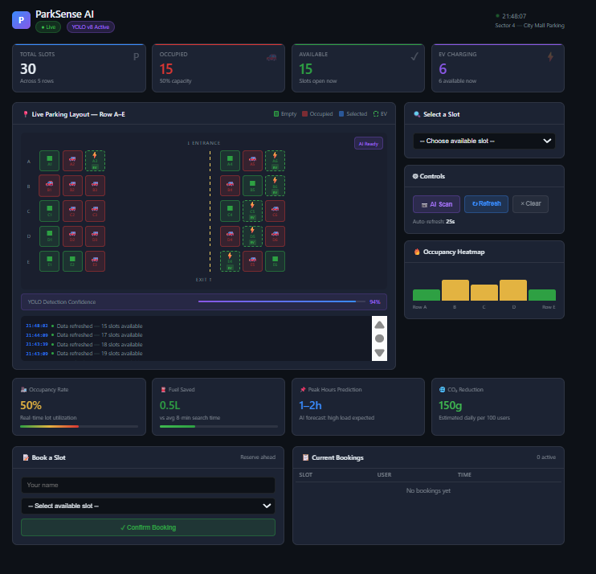
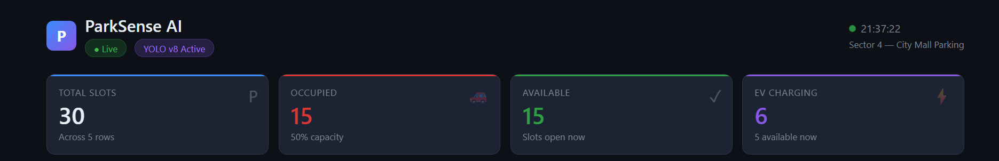
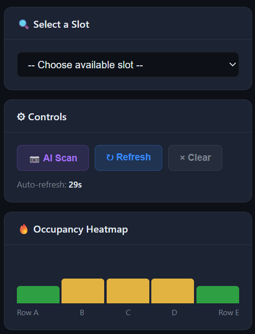
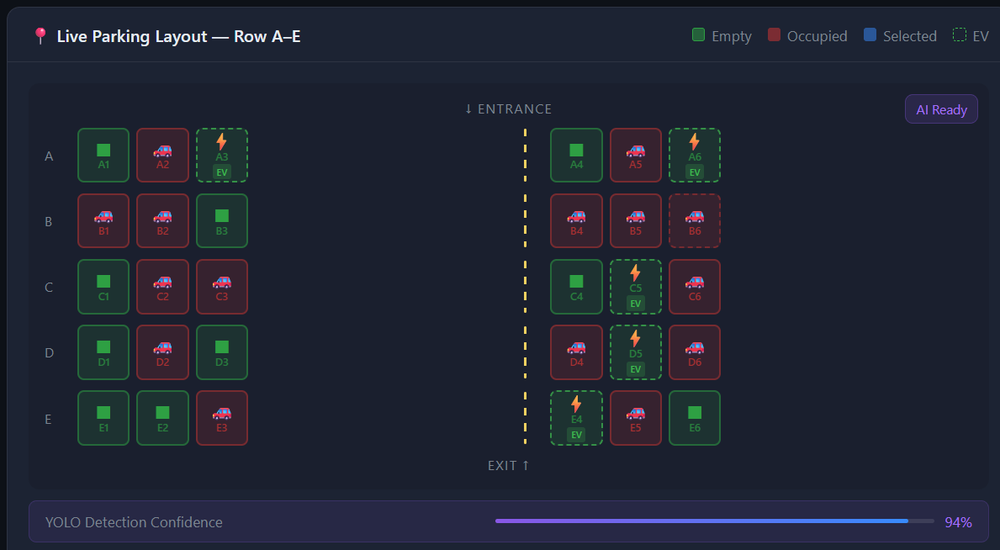
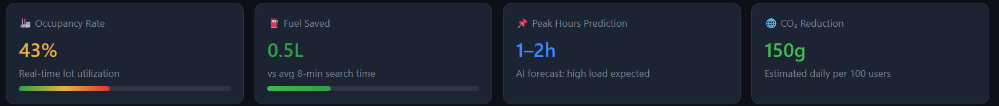
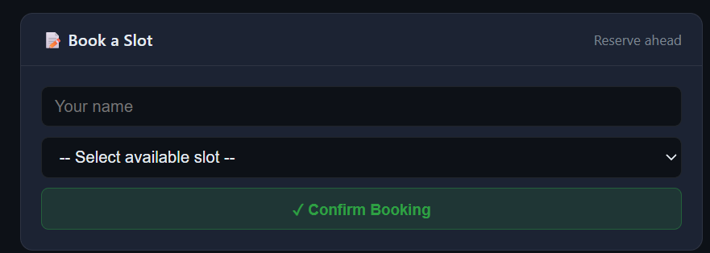
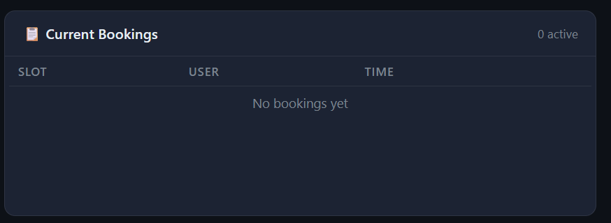

# 🚗 ParkSense AI — Smart Parking System

## 📌 Overview

ParkSense AI is an interactive smart parking system that simulates real-time parking slot availability with an intuitive UI.
It includes a modular backend booking system built using Flask, allowing users to reserve and manage parking slots.

---

## 📸 Screenshots








---

## 🚀 Features

### 🅿️ Parking Dashboard

* Live parking layout (Row A–E)
* Slot status (Available / Occupied)
* EV charging slots ⚡
* Auto-refresh simulation

### 🎯 Slot Interaction

* Select available parking slots
* Route guidance simulation
* Real-time metrics (occupancy, availability)

### 🔗 Booking System (API-Based)

* Book a slot via API
* View all bookings
* Cancel bookings
* Persistent booking state (not affected by refresh)

---

## ⚙️ Tech Stack

* **Frontend:** HTML, CSS, JavaScript
* **Backend:** Flask (Python)
* **Architecture:** Modular (separate booking module)

---

## 📡 API Endpoints

| Method | Endpoint    | Description       |
| ------ | ----------- | ----------------- |
| GET    | `/`         | Dashboard UI      |
| POST   | `/book`     | Book a slot       |
| GET    | `/bookings` | View all bookings |
| POST   | `/cancel`   | Cancel booking    |

---


## ▶️ Run Locally


git clone https://github.com/divyanshurai2009/PARK-SENSE-AI.git
cd parksense-ai
pip install -r requirements.txt
python app.py
```

Open in browser:

```
http://127.0.0.1:5000
```

---

## 🧠 Key Highlights

* Modular architecture (feature extension without breaking UI)
* Real-time simulation with auto-refresh
* Backend API integration with frontend sync
* Clean and interactive user interface

---

## 🎯 Future Improvements

* Database integration (SQLite/MongoDB)
* User authentication system
* Real-time sensor/IoT integration


---

## 👨‍💻 Author

Divyanshu Rai
